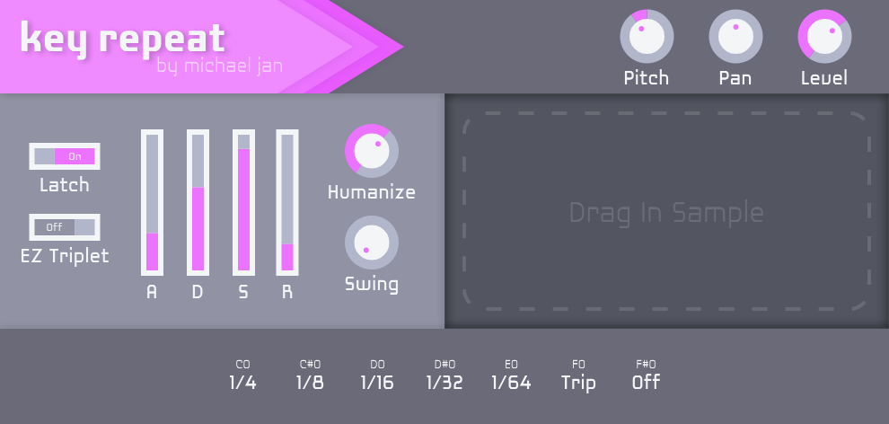

# Key Repeat

MPC-style note repeat in a free VST.

Key Repeat is a free and lightweight audio sampler plugin inspired by "note repeat" functionality of the [Akai MPC](https://www.akaipro.com/products/mpc-series "The Akai MPC is a series of hardware samplers produced by Akai"). This project is currently a **work in progress**. Downloads in VST3, AU[v3], and AAX formats will be available soon!

## Why Key Repeat?
With Key Repeat, you get:
* **Efficiency.** Drag in a sample and start recording note-repeats instantly. Key Repeat syncs itself to your DAW's tempo.
* **Ease of Use.** Turn on EZ Triplet mode and never hold two keyswitches again! See the manual [WIP] for more info.
* **Control.** Whether it's through tweaking your sample's ADSR envelope, throwing in some humanization, or adding in a slight swing, Key Repeat puts you in control of your sound.

## Quick Start Guide

1. Download the plugin and load it up in your DAW.
2. After dragging your sample into the plugin, hold down middle-C on your MIDI keyboard to start note-repeating, using the keyswitches (C0-F#0) to control the repeat rate.
3. Start experimenting!

## Download
Downloads in VST3, AU[v3], and AAX formats will be available soon!
